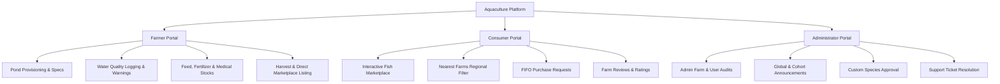
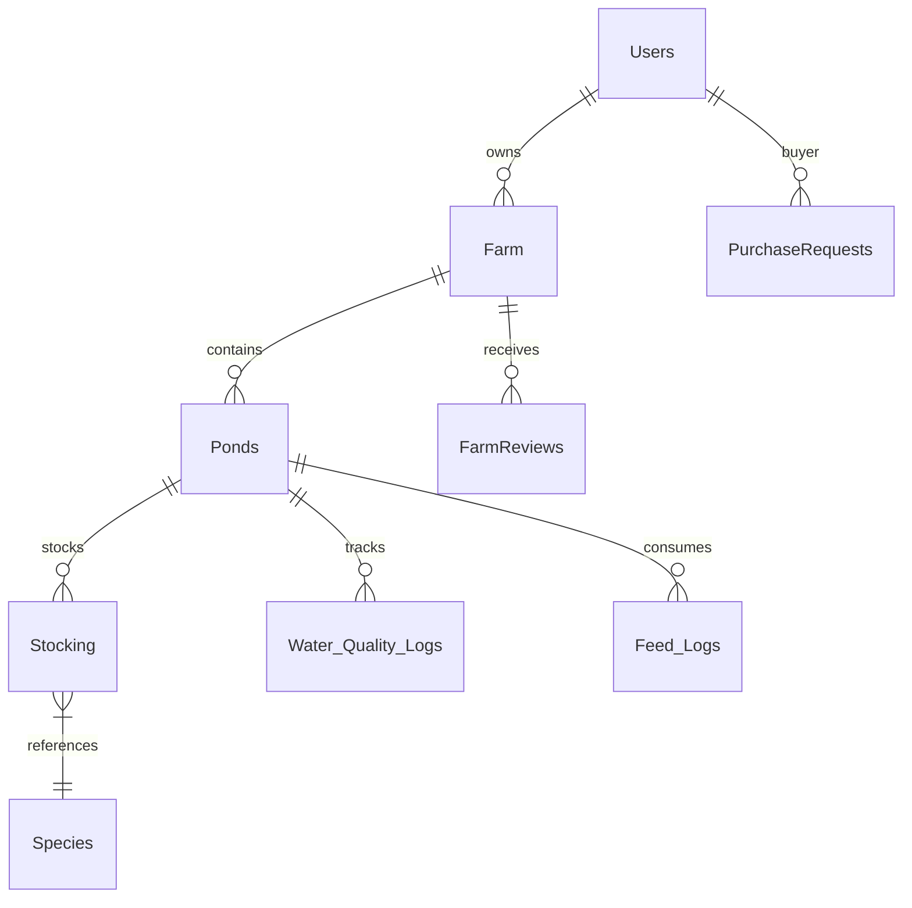

# Smart Fish Farming Management Platform 🐟
## Master Architecture, Features, and API Reference Manual

This technical manual serves as a comprehensive system documentation guide for your Final Year Project (FYP) evaluation. It details every functional module, user actor flow, architectural detail, backend API endpoint, frontend integration point, and the complex SQL database queries driving the system.

---

## 📖 Table of Contents
1. [System Overview & Value Proposition](#1-system-overview--value-proposition)
2. [User Roles & Architectural Actor Flows](#2-user-roles--architectural-actor-flows)
3. [Key Functional Modules (The "How-It-Works" Guide)](#3-key-functional-modules-the-how-it-works-guide)
4. [Backend Routing Architecture & API Blueprint](#4-backend-routing-architecture--api-blueprint)
5. [Primary Database Schema & Key SQL Queries](#5-primary-database-schema--key-sql-queries)
6. [Frontend UI/UX Design System & Features](#6-frontend-uiux-design-system--features)
7. [Comprehensive Feature Matrix (Frontend, Backend, and Database Mappings)](#7-comprehensive-feature-matrix-frontend-backend-and-database-mappings)

---

## 1. System Overview & Value Proposition
The **Smart Fish Farming Management Platform** is a state-of-the-art aquaculture planning, monitoring, and P2P commerce suite. Built using a modern React SPA frontend, a Node.js Express API gateway, and a robust Microsoft SQL Server (MSSQL) relational database, the platform replaces guesswork with data-driven aquaculture guidelines.

### 🌟 Core Value Proposition:
* **Precision Aquaculture Guidelines**: Prevents common farm startup losses by calculating optimal pond dimensions and stocking counts based on database-driven mathematical biological limits.
* **Polyculture Synergy**: Manages species allocation ratios based on active **feeding zones** (Surface, Column, Bottom) to eliminate food competition and feed wastage.
* **Peer-to-Peer Marketplace**: Connects local farmers directly to consumers, cutting out middle-men and providing instant digital sales workflows with FIFO-based inventory tracking.
* **FCR & Expense Ledger**: Empowers farmers to log feed, water parameter audits, and expenses to track FCR (Feed Conversion Ratio) and exact profit-loss margins.

---

## 2. User Roles & Architectural Actor Flows

The system enforces three isolated user roles, each accessing specialized screens and workflows:



### A. The Farmer
* **Setup & Provisioning**: Can setup their farm, name it, specify target district/province, and construct ponds using automated dimension specs.
* **Operations**: Add fish batches, log daily mortalities, track water cycles, record fertilizer/chemical inputs, and distribute exact feed weights.
* **Harvest & Sales**: Select harvest-ready batches, log total harvested weight, set custom prices, and list inventory directly on the consumer marketplace.

### B. The Consumer
* **Marketplace Discovery**: View active listings of harvested fish across various farms. Filters by species, region, or dynamically selects **Nearest Farms** to find fish within their exact province/district.
* **P2P Transactions**: Submit purchase requests specifying target quantities, calculate estimated costs in PKR, and track approval status.
* **Review Cycle**: View past transactions and leave ratings and text reviews for individual farms.

### C. The Administrator
* **Farm & User Moderation**: Review active farm statistics, delete rogue users (safely triggering full database cascade deletes), and manage system permissions.
* **Rules & Catalog Engine**: Moderate custom species requests, update default `StockingRules` (Max Density per Acre), and inspect support tickets.
* **Cohort Broadcaster**: Send global announcements or push targeted updates directly to all Farmers, all Consumers, or specific individuals.

---

## 3. Key Functional Modules (The "How-It-Works" Guide)

### 🌾 Pond Creation & Dimension Recommendation
When a farmer creates a new pond, the system requests their desired fish batch count and target farming stage (`Nursery` or `Grow-out`).
* **The Math**: The system runs a specialized helper method `calculatePondSpecs` checking target species stocking densities (e.g., Nursery requires less space, Grow-out requires far more).
* **The Size recommendation**: The server returns an optimal acreage (`requiredAcres`), standard rectangular length/width guides, depth recommendations, and estimated water volume.
* **Data Integrity**: During pond creation, the computed size serves as a recommendation. The user has full flexibility to enter their actual size (e.g., 4 acres) which is permanently stored as the database source-of-truth.

### 📊 Dynamic Capacity & Utilization Metering
Ponds do not have hardcoded capacity caps.
* **Rule Extraction**: Every time the dashboard mounts, the frontend fetches the exact stocking rules via `GET /api/ponds/:id/capacity`.
* **Stocking Density**: It pulls `MaxFishPerAcre` from `StockingRules` matching the pond's specific cultivation stage (Nursery vs Grow-out) and structure (Extensive/Semi-Intensive/Intensive).
* **Utilization**:
  $$\text{Utilization \%} = \min\left(100, \frac{\text{Current Stocked Fish}}{\text{Pond Acreage} \times \text{MaxFishPerAcre}} \times 100\right)$$
* **Utilization Ring & Bars**: The UI renders color-coded progress bars (🟢 `< 70%` safe, 🟡 `70-90%` high density warning, 🔴 `> 90%` critical overcrowding risk).

### 🐟 Polyculture Feeding Zone Alignment
Polyculture ponds stock multiple species simultaneously. If all stocked species feed at the same depth, they compete for food, leading to stunted growth.
* **The Zones**: Species are classified into three primary feeding zones:
  1. **Surface Feeders**: (e.g., Catla, Silver Carp) - Feed on surface plankton.
  2. **Column Feeders**: (e.g., Rohu) - Feed in the mid-water column.
  3. **Bottom Feeders**: (e.g., Mrigal, Common Carp) - Scavenge the bottom.
* **Zone Ratios**: The system computes safe feeding capacity allocations:
  - Column Feeders occupy up to **40%** of the pond capacity.
  - Surface and Bottom Feeders occupy up to **30%** each of the capacity.
* **Feed Competition Prevention UI**: The pond card displays an active per-species progress bar showing exactly how close that species is to its zone limit. If a farmer attempts to stock too many column feeders, the UI flags a warning and prevents further stocking of that specific type, suggesting alternative species instead.

### 🧪 Water Quality Cycles & Auto-Alerts
Aquaculture is highly sensitive to water quality. The system features a localized laboratory logger.
* **Logging Parameters**: Farmers log pH, Temperature (°C), Dissolved Oxygen (DO in mg/L), and Ammonia levels.
* **Alert Boundaries**:
  * **pH**: Normal: `6.5 - 8.5`.
  * **Dissolved Oxygen**: Normal: `> 5.0 mg/L` (Danger: `< 3.0` triggers urgent aerator activation warning).
  * **Temperature**: Normal: `20°C - 32°C`.
  * **Ammonia**: Normal: `< 0.05 ppm` (Danger: `> 0.1` triggers water exchange warning).
* **The UI Alert**: Red banner alerts appear on the dashboard displaying immediate remedial advice if any metric drifts outside safety margins.

### 💰 Financial Ledger & FCR Optimization
Keeps track of every rupee spent and every gram of feed converted into growth.
* **Feed Conversion Ratio (FCR)**:
  $$\text{FCR} = \frac{\text{Total Feed Applied (kg)}}{\text{Total Fish Mass Gained (kg)}}$$
  An FCR of `1.2 - 1.5` is considered highly efficient. A higher FCR indicates feed wastage.
* **Financial Ledger**: Tracks structural costs, feed purchases, and chemical applications as Expenses, against fish sales as Revenue, outputting a precise interactive financial graph.

---

## 4. Backend Routing Architecture & API Blueprint

The Express server maps routes cleanly across the standard port `5000`. All core operations are protected by a JWT-based authentication middleware (`auth.js`).

### A. Authentication & User Profile (`/api/auth`)
* `POST /signup`: Hashes passwords via `bcrypt` (10 rounds) and registers a new User with Role (`user`, `Consumer`, or `admin`), `Province`, and `District`.
* `POST /login`: Verifies credentials and signs a JWT containing `{ id: UserId, role: Role }` valid for 24 hours.

### B. Farm & Setup Operations (`/api/farm`)
* `POST /setup`: Sets up a new farm boundary, recording total acreage.
* `POST /provision-pond`: Provisions custom pond specs alongside species guidelines.
* `POST /calculate-pond-specs`: Heavy computation helper. Takes a species count, target stage, and returns optimal layout recommendations.
* `GET /my-farm`: Fetches the logged-in user's farm details.
* `GET /daily-tasks`: Returns custom and auto-generated daily aquaculture tasks.

### C. Pond Management (`/api/ponds`)
* `GET /`: Lists all active ponds owned by the logged-in farmer.
* `POST /`: Creates a new pond and stores its structural and cultivation settings.
* `GET /:id/capacity`: Fetches accurate stocking rules and polyculture feeding zone limits.
* `DELETE /:id`: Safely deletes a pond, automatically executing clean cascade deletes across all child tables.

### D. Fish & Stocking Operations (`/api/stocking`)
* `POST /stock`: Adds a new batch of fish to a pond.
* `GET /active`: Fetches currently stocked fish batches.
* `POST /transfer`: Executes partial or full transfers of fish between ponds. Validates nursery-to-growout stage compatibilities and blocks transfers that would exceed the target pond's capacity.

### E. Peer-to-Peer Marketplace (`/api/marketplace`)
* `GET /`: Fetches all available fish stock listings. Supports filtering by species, region, or **Nearest Farms** (which dynamically resolves and matches consumer province/district directly inside SQL).
* `POST /request-buy`: Initiates a purchase request from a consumer to a farmer.
* `GET /my-requests`: Returns a consumer's pending, approved, and denied purchase orders.
* `POST /approve-sell`: Triggers transaction finalization. Subtracts stock from the farmer's inventory using a strict FIFO (First-In, First-Out) method, marks depleted batches as `Sold`, and logs a record to `Sales_Logs`.

---

## 5. Primary Database Schema & Key SQL Queries

Below are the primary SQL database tables and the key complex queries powering the platform.



### Key Database Tables:
1. `Users`: Stores login details, role (`user` [Farmer], `Consumer`, `admin`), `Province`, and `District`.
2. `Farm`: Stores farm profile, overall acreage, and references the owner's `UserId`.
3. `Ponds`: Stores pond details: `Size` (acres), `Stage` (Nursery/Grow-out), `CultivationType` (Intensive/Semi-Intensive/Extensive), and structural volume.
4. `Stocking`: Tracks active fish batches: `Quantity`, `CurrentSizeInches`, `Status` (Growing/Harvested/Sold), and flag `IsForSale`.
5. `Regions`: Master table of climate, water availability, and standard province coordinates.
6. `PurchaseRequests`: Connects consumers to farmers, managing transaction quantities and approval stages.

---

### Key SQL Queries & Operations:

#### 1. Dynamic Polyculture Capacity calculation (`GET /api/ponds/:id/capacity`)
Fetches active stocking metrics, identifies feeding zone limits, and returns individual species breakdowns:
```sql
-- 1. Fetch pond details and cultivation stage limits
SELECT P.PondId, P.Size, P.Stage, P.CultivationType, P.CultureType,
       SR.MaxFishPerAcre, SR.MaxSpeciesAllowed
FROM Ponds P
LEFT JOIN StockingRules SR ON P.Stage = SR.CultureStage
       AND P.CultivationType = SR.CultivationSystem
WHERE P.PondId = @pId AND P.UserId = @uId;

-- 2. Fetch active species counts, species names, and biological feeding zones
SELECT ST.SpeciesId, S.Name as speciesName, S.FeedingZone, SUM(ST.Quantity) as currentQty
FROM Stocking ST
JOIN Species S ON ST.SpeciesId = S.SpeciesId
WHERE ST.CurrentPondId = @pId AND ST.Quantity > 0
GROUP BY ST.SpeciesId, S.Name, S.FeedingZone;
```

#### 2. Nearest Farms Marketplace matching (`GET /api/marketplace?regionId=nearest`)
Resolves listings that match the logged-in consumer's regional boundary:
```sql
SELECT
    U.FarmName,
    U.FullName as FarmerName,
    F.FarmId,
    S.SpeciesId,
    S.Name as SpeciesName,
    SUM(ST.Quantity) as TotalQuantity,
    AVG(ST.CurrentSizeInches) as AvgSizeInches,
    AVG(ST.PricePerPiece) as AvgPrice,
    RG.RegionName
FROM Stocking ST
JOIN Ponds P ON ST.CurrentPondId = P.PondId
JOIN Farm F ON P.FarmId = F.FarmId
JOIN Users U ON F.UserId = U.UserId
JOIN Species S ON ST.SpeciesId = S.SpeciesId
LEFT JOIN Regions RG ON F.RegionId = RG.RegionId
WHERE ST.Quantity > 0
  -- Dynamic nearest matching clause:
  AND (RG.Province = @consumerProv OR RG.RegionName LIKE '%' + @consumerDist + '%')
GROUP BY
    U.FarmName, U.FullName, F.FarmId,
    S.SpeciesId, S.Name, ST.Status, RG.RegionName;
```

#### 3. Cascade Safe Deletion (`DELETE /api/ponds/:id`)
Safely deletes a pond by executing localized cascade cleanups inside an isolated MSSQL Transaction:
```sql
BEGIN TRANSACTION;
-- Clean up all operational tables referencing the target Pond
DELETE FROM Pond_Inventory WHERE PondId = @Id;
DELETE FROM Mortality_Logs WHERE PondId = @Id;
DELETE FROM Feed_Logs WHERE PondId = @Id;
DELETE FROM Water_Quality_Logs WHERE PondId = @Id;
DELETE FROM Treatment_Logs WHERE PondId = @Id;
DELETE FROM Sales_Logs WHERE PondId = @Id;
DELETE FROM Stocking WHERE CurrentPondId = @Id;

-- Delete the main Pond record
DELETE FROM Ponds WHERE PondId = @Id;
COMMIT TRANSACTION;
```

#### 4. FIFO Sales Inventory Deduction (`POST /api/marketplace/approve-sell`)
When a farmer approves a sale, stock is deducted from the oldest stocked batches first (FIFO):
```sql
-- 1. Identify active, growing/harvested batches of the target species
SELECT ST.StockId, ST.Quantity, ISNULL(ST.ForSaleQuantity, 0) as ForSaleQuantity, ST.PricePerPiece, ST.CurrentPondId
FROM Stocking ST
JOIN Ponds P ON ST.CurrentPondId = P.PondId
WHERE P.FarmId = @farmId AND ST.SpeciesId = @speciesId
  AND ST.IsForSale = 1 AND ST.Quantity > 0
ORDER BY ST.StockingDate ASC; -- Oldest stocked batches first (FIFO)

-- 2. Deduct target stock quantity from each batch (iterative loop)
UPDATE Stocking
SET ForSaleQuantity = CASE WHEN ForSaleQuantity > 0 THEN ForSaleQuantity - @deduct ELSE 0 END,
    Quantity = Quantity - @deduct
WHERE StockId = @stockId;

-- 3. Deplete fully sold batches
UPDATE Stocking
SET Status = 'Sold', IsForSale = 0
WHERE StockId = @stockId AND Quantity <= 0;
```

---

## 6. Frontend UI/UX Design System & Features

The user interface is a premium, interactive React SPA styled with highly tailored CSS components.

### 🎨 Key Design Enhancements:
* **Glassmorphism Panels**: Modern glass panels (`backdrop-blur-md bg-white/80`) combined with harmonized colors (deep blues for aquaculture, emerald for biological stats, amber for warning zones).
* **Dynamic Modals**: Standardized modal overlays featuring custom animations (`transition-all duration-300`) and comprehensive input validation.
* **Interactive Dashboard Tours**: Includes a guided overlay tour (`hasCompletedDashboardTour`) built on React state hooks to navigate new evaluators through the interface step-by-step.
* **Feature Toggles**: Highly organized code block comment tags allow manual switching of advanced features (like active treatment logs or administrative panels) for offline presentation mode.

---

## 7. Comprehensive Feature Matrix (Frontend, Backend, and Database Mappings)

This matrix outlines every single user action, filter dropdown, and interactive UI module in the application, mapping them to the specific backend routes, source files, and database tables that combine to make them work.

### 🔐 A. Authentication & Gateway Portal
* **Features**:
  * Dual signup pipelines for Farmers & Consumers.
  * Rigid login gates redirecting to Admin, Consumer, or Farmer specific layouts.
  * Role and JWT token validation check middleware.
* **Dropdowns & Controls**:
  * **Role Selector Dropdown** (`user` / `Consumer`) in Sign Up form.
  * **Strict Portal Access Buttons** (Login as Farmer, Login as Admin, Login as Consumer).
* **Files Used**:
  * **Frontend Pages**: `src/pages/LoginPage.jsx`, `src/pages/SignupPage.jsx`.
  * **Frontend Components**: `src/components/AuthWrapper.jsx`, `src/components/NavBar.jsx`.
  * **Backend Route**: `backend/routes/authRoutes.js`.
  * **Database Table**: `Users` (UserId, FullName, Email, PasswordHash, Role, Province, District).

### 🏡 B. Farmer Dashboard & Dynamic Pond Management
* **Features**:
  * Dynamic Pond cards displaying active stocked species breakdowns.
  * Interactive guided onboarding tour for first-time farmers.
  * Multi-dimensional pond sizing recommendation guide.
  * Polyculture feeding-depth warning bars.
  * Dynamic color-coded capacity meter (🟢 Green/🟡 Amber/🔴 Red).
* **Dropdowns & Controls**:
  * **Pond Filter & Search Bar**: Filter by pond stage, search bar by pond name, hide empty ponds check.
  * **Sort Dropdown**: Sort by default, size, stocked count, pending alerts, recent.
  * **Pond Stage Selector Dropdown** (`Nursery` / `Grow-out`) in pond creation modal.
  * **Cultivation Type Dropdown** (`Extensive` / `Semi-Intensive` / `Intensive`).
* **Files Used**:
  * **Frontend Pages**: `src/pages/DashboardPage.jsx`.
  * **Frontend Components**: `src/components/AddPondModal.jsx`, `src/components/EditPondModal.jsx`, `src/components/AddFishModal.jsx`, `src/components/TransferFishModal.jsx`, `src/components/OnboardingTour.jsx`.
  * **Backend Route**: `backend/routes/pondRoutes.js`, `backend/routes/stockingRoutes.js`, `backend/routes/rulesRoutes.js`.
  * **Database Table**: `Ponds` (PondId, Size, Stage, CultivationType, UserId), `Stocking` (StockId, Quantity, CurrentSizeInches, Status), `StockingRules` (MaxFishPerAcre, MaxSpeciesAllowed).

### 🧪 C. Daily Operations, Feed & Water Parameter Auditing
* **Features**:
  * Water quality parameter logging with dynamic health assessment checks (pH, DO, Ammonia, Temperature).
  * Auto-alert banner showing critical aeration warnings.
  * FCR (Feed Conversion Ratio) calculation and ledger.
  * Fertilizer logs and operational inventories.
* **Dropdowns & Controls**:
  * **Pond Selection Dropdown** in water log and feeding modals.
  * **Feed Category Dropdown** in feed stocking entries.
* **Files Used**:
  * **Frontend Pages**: `src/pages/WaterQualityPage.jsx`, `src/pages/FeedingManagementPage.jsx`, `src/pages/FertilizationPage.jsx`.
  * **Frontend Components**: `src/components/WaterCycleModal.jsx`, `src/components/ManageFeedModal.jsx`, `src/components/FertilizerModal.jsx`, `src/components/MortalityModal.jsx`.
  * **Backend Route**: `backend/routes/waterQualityRoutes.js`, `backend/routes/feedRoutes.js`, `backend/routes/fertilizersRoute.js`, `backend/routes/mortalityRoutes.js`.
  * **Database Table**: `Water_Quality_Logs`, `Feed_Logs` (PondId, FeedWeight, FeedType), `Fertilizer_Logs`, `Mortality_Logs` (PondId, QuantityDead).

### 🏥 D. Disease Diagnostic & Medication Outbreaks
* **Features**:
  * Library of common fish diseases and cure directories.
  * Active disease outbreak banner alerts overlaid on affected ponds.
  * Medication logs tracking applied doses.
* **Dropdowns & Controls**:
  * **Disease Selection Dropdown** (e.g., Ich, Tail Rot, Red Pest).
  * **Pond Target Dropdown** to log outbreaks.
* **Files Used**:
  * **Frontend Pages**: `src/pages/DashboardPage.jsx` (disease toggles).
  * **Frontend Components**: `src/components/LogDiseaseModal.jsx`, `src/components/LogTreatmentModal.jsx`, `src/components/MedicationModal.jsx`, `src/components/admin/AdminDiseaseCatalog.jsx`.
  * **Backend Route**: `backend/routes/diseaseRoutes.js`, `backend/routes/medicationRoutes.js`.
  * **Database Table**: `Disease_Outbreaks` (OutbreakId, PondId, DiseaseId, Status), `Treatment_Logs`, `Disease_Library`, `Medications`.

### 📦 E. Inventory & Operational Stock Management
* **Features**:
  * Quantitative tracking of feed bags, fertilizer weights, and medication counts.
  * Custom species creation requests submitted by farmers.
* **Dropdowns & Controls**:
  * **Inventory Categories Tabs** (Fingerlings, Feed, Fertilizers, Medications).
* **Files Used**:
  * **Frontend Pages**: `src/pages/StockPage.jsx`, `src/pages/SpeciesPage.jsx`.
  * **Frontend Components**: `src/components/AddFeedStockModal.jsx`, `src/components/AddFertilizerStockModal.jsx`, `src/components/AddMedicationStockModal.jsx`, `src/components/EditInventoryModal.jsx`, `src/components/TransferInventoryModal.jsx`.
  * **Backend Route**: `backend/routes/inventoryRoutes.js`, `backend/routes/speciesRoutes.js`.
  * **Database Table**: `Inventory` (ItemId, ItemName, Quantity, Category, FarmId), `Species` (SpeciesId, Name, FeedingZone, IsApproved).

### 💰 F. Financial Ledger, Harvest & ROI Forecasting
* **Features**:
  * Real-time budget tracking and profit/loss calculation graphs.
  * Fish batch harvesting logs measuring ROI.
* **Dropdowns & Controls**:
  * **Harvest Pond Dropdown** matching growing grow-out ponds.
  * **Expense Category Selector** (Feed, Structural, Chemicals, etc.).
* **Files Used**:
  * **Frontend Pages**: `src/pages/BudgetExpensesPage.jsx`, `src/pages/FarmReportsPage.jsx`.
  * **Frontend Components**: `src/components/AddExpenseModal.jsx`, `src/components/HarvestModal.jsx`, `src/components/HarvestROIModal.jsx`.
  * **Backend Route**: `backend/routes/expenseRoutes.js`, `backend/routes/harvestRoutes.js`.
  * **Database Table**: `Expenses` (ExpenseId, Category, Amount, FarmId), `Harvest_Logs` (HarvestId, Quantity, TotalWeight, ExpectedROI).

### 🛒 G. Peer-to-Peer (P2P) Marketplace & Commerce
* **Features**:
  * Comprehensive local buyer-seller discovery board.
  * Regional filter matching consumers to nearest farms.
  * Fully automated FIFO-based inventory subtraction.
  * Star rating and reviews on farm profiles.
* **Dropdowns & Controls**:
  * **Region Selection Dropdown**: Matches RegionIds, All Regions, or the custom **📍 Nearest Farms (My Region)**.
  * **Species Pills Selection**: Fast filtering pills.
  * **Sorting Dropdown**: Default, Favorites Only, Price: Low → High, Price: High → Low, Species: A-Z, Quantity: High → Low, Quantity: Low → High, Highest Rating, Recently Stocked.
* **Files Used**:
  * **Frontend Pages**: `src/pages/MarketplacePage.jsx`.
  * **Frontend Components**: `src/components/PurchaseRequestsModal.jsx`, `src/components/SetForSaleModal.jsx`.
  * **Backend Route**: `backend/routes/marketplaceRoutes.js`, `backend/routes/reviewRoutes.js`.
  * **Database Table**: `PurchaseRequests` (RequestId, BuyerUserId, FarmId, SpeciesId, Quantity, Status), `MarketplaceFavorites`, `FarmReviews`, `Sales_Logs`.

### 🛡️ H. Administrative Moderation Portal
* **Features**:
  * Farm boundary approvals.
  * Role modification & safe cascade user deletions.
  * Targeted global announcements board.
  * Farmer-to-Admin support ticket inbox system.
* **Dropdowns & Controls**:
  * **Announcement Recipient Filter Dropdown** (Broadcast to: All, Farmers, Consumers, Selected).
* **Files Used**:
  * **Frontend Pages**: `src/pages/AdminPage.jsx`.
  * **Frontend Components**: `src/components/admin/AdminUserManagement.jsx`, `src/components/admin/AdminFarmOverview.jsx`, `src/components/admin/AdminSupportTickets.jsx`, `src/components/admin/AdminRulesManagement.jsx`.
  * **Backend Route**: `backend/routes/adminRoutes.js`, `backend/routes/announcementRoutes.js`, `backend/routes/supportRoutes.js`.
  * **Database Table**: `Users`, `Farm`, `SupportTickets` (TicketId, SenderUserId, Message, ReplyStatus), `Announcements` (AnnouncementId, RecipientGroup, MessageText).


hfuhbbuhjuh{}{}{
  HBBBUIhiu77t62BUBBUJBUk

  jubububhqbuwchhbhj
}
hhuy hbbgiubkjkjbiubbwvsvbb


bh  jbjhbbhbsv