<a id="top"></a>

# 🐟 Aquaculture Management Platform
### Fish Farming Guide

<p align="center">
  <a href="https://github.com/daniyal-sec/FishFarmingGuide">
    
  </a>
</p>

<p align="center">
  
</p>

<p align="center">
  
  
  
</p>

<p align="center">
  <a href="https://github.com/daniyal-sec/FishFarmingGuide/stargazers"></a>
  <a href="https://github.com/daniyal-sec/FishFarmingGuide/network/members"></a>
  <a href="https://github.com/daniyal-sec/FishFarmingGuide/commits"></a>
  <a href="https://github.com/daniyal-sec/FishFarmingGuide"></a>
</p>

<p align="center">
A comprehensive web-based aquaculture management platform developed as a Computer Science Final Year Project (FYP), designed to support fish farmers with farm planning, stock management, feeding, water-quality monitoring, marketplace operations, and data-driven aquaculture workflows.
</p>

<p align="center">
  <a href="#key-features">✨ Features</a> ·
  <a href="#technology-stack">🛠️ Tech Stack</a> ·
  <a href="#application-screenshots">🖥️ Screenshots</a> ·
  <a href="#installation-and-setup">🚀 Setup</a> ·
  <a href="#project-team">👥 Team</a> ·
  <a href="https://github.com/daniyal-sec/FishFarmingGuide">🔗 Repository</a>
</p>

<p align="center">
  
</p>

## 📖 Table of Contents

- [🎓 Project Overview](#project-overview)
- [✨ Key Features](#key-features)
- [🏗️ Architecture](#architecture)
- [🛠️ Technology Stack](#technology-stack)
- [📂 Project Structure](#project-structure)
- [🖥️ Application Screenshots](#application-screenshots)
- [🚀 Installation and Setup](#installation-and-setup)
- [🔐 Environment Configuration](#environment-configuration)
- [🗄️ Database](#database)
- [📚 API and Documentation](#api-and-documentation)
- [🔮 Future Improvements](#future-improvements)
- [👥 Project Team](#project-team)
- [📜 License](#license)

<p align="center">
  
</p>

## Project Overview

> 🎓 Aquaculture Management Platform (Fish Farming Guide) is a Computer Science Final Year Project. It is a web-based platform supporting fish farming/aquaculture management, helping to bridge the gap between traditional farming and modern data-driven practices.

<div align="right"><a href="#top">⬆ Back to Top</a></div>

## Key Features

|  |  |
|---|---|
| 🐠 **Pond & Capacity Planning** | 🐟 **Polyculture Feeding Zone Alignment** |
| 💧 **Water Quality Monitoring** | 🍽️ **Stock & Feeding Management** |
| 📈 **Harvest and ROI Tracking** | 🛒 **P2P Digital Marketplace** |
| 📦 **FIFO Inventory Handling** | 🗺️ **Regional/Geospatial Functionality** |
| 🔐 **Role-Based Access Control** | 👥 **Admin / Farmer / Consumer Workflows** |
| 🔑 **JWT Authentication** | 🔒 **bcrypt Password Hashing** |
| 🐡 **Species Management** | 📋 **Feed Rules** |

<div align="right"><a href="#top">⬆ Back to Top</a></div>

## Architecture

**🎨 Frontend**

<p>
  
  
  
  
  
</p>

**⚙️ Backend**

<p>
  
  
  
</p>

**🗄️ Database**

<p>
  
</p>

**🔐 Authentication**

<p>
  
  
  
</p>

<div align="right"><a href="#top">⬆ Back to Top</a></div>

## Technology Stack

<p>
  
  
  
  
  
  
  
  
  
  
  
</p>

<div align="right"><a href="#top">⬆ Back to Top</a></div>

## Project Structure

*Repository layout at a glance:*

```text
FishFarmingGuide/
├── assets/
│   ├── hero-banner.svg
│   ├── divider-wave.svg
│   ├── divider-current.svg
│   └── footer-banner.svg
├── backend/
│   ├── config/
│   ├── middleware/
│   ├── routes/
│   ├── server.js
│   ├── package.json
│   ├── package-lock.json
│   ├── .env.example
│   └── FishFarm.postman_collection.json
├── database/
│   └── schema.sql
├── docs/
│   └── evaluation/
├── fish-farming-guide/
├── screenshots/
│   ├── admin-login.png
│   ├── admin-dashboard.png
│   ├── farmer-login.png
│   ├── farmer-dashboard.png
│   ├── consumer-login.png
│   └── consumer-dashboard.png
├── PROJECT_TECHNICAL_REFERENCE.md
├── .gitignore
└── README.md
```

<div align="right"><a href="#top">⬆ Back to Top</a></div>

<p align="center">
  
</p>

## Application Screenshots

<div align="center">

<table>
<tr>
<td align="center"><strong>Admin Dashboard</strong><br/></td>
<td align="center"><strong>Farmer Dashboard</strong><br/></td>
<td align="center"><strong>Consumer Dashboard</strong><br/></td>
</tr>
</table>

### 🔐 Role-Based Access

The application provides dedicated authentication and workflows for Admin, Farmer, and Consumer roles.

<table>
<tr>
<td align="center"><strong>Admin Login</strong><br/></td>
<td align="center"><strong>Farmer Login</strong><br/></td>
<td align="center"><strong>Consumer Login</strong><br/></td>
</tr>
</table>

</div>

<div align="right"><a href="#top">⬆ Back to Top</a></div>

<p align="center">
  
</p>

## Installation and Setup

### Prerequisites

- Node.js
- npm
- Microsoft SQL Server
- SQL Server Management Studio or equivalent SQL client

### Database Setup

1. Create the required SQL Server database.
2. Run `database/schema.sql`.
3. Note: Real development/user data was intentionally excluded from the public repository. The provided schema contains the public database schema and safe generic seed/configuration data.

### Backend Setup

Navigate to the backend directory and install dependencies:

```bash
cd backend
npm install
```

Create a local environment file from the example:

```bash
cp .env.example .env
```

Configure your own database credentials and JWT secret inside the `.env` file.

Start the backend:

```bash
node server.js
```

The default backend port is `5000` unless `PORT` is configured otherwise.

### Frontend Setup

Navigate to the frontend directory, install dependencies, and start the development server:

```bash
cd fish-farming-guide
npm install
npm run dev
```

For a production build, run:

```bash
npm run build
```

<div align="right"><a href="#top">⬆ Back to Top</a></div>

## Environment Configuration

The application requires the following environment variables. The `backend/.env` file is intentionally excluded from GitHub. Each developer must create their own local `.env` file based on `.env.example`. No real credentials are included in the public repository.

```env
DB_SERVER=
DB_NAME=
DB_PORT=
DB_USER=
DB_PASSWORD=
JWT_SECRET=
PORT=
```

<div align="right"><a href="#top">⬆ Back to Top</a></div>

## Database

🗄️ The `database/schema.sql` script contains the public database schema and safe generic seed/configuration data. Real development and user records were strictly removed before publication.

<div align="right"><a href="#top">⬆ Back to Top</a></div>

## API and Documentation

- **Postman API Collection:** `backend/FishFarm.postman_collection.json` can be imported into Postman for API testing. Authentication tokens are handled using Postman variables rather than publishing real tokens.
- **Technical Reference:** Detailed mathematical algorithms and schema architectures are documented in `PROJECT_TECHNICAL_REFERENCE.md`.
- **Evaluation Details:** Feature-toggle documentation and grading configurations are stored in `docs/evaluation/`.

<div align="right"><a href="#top">⬆ Back to Top</a></div>

## Future Improvements

- [ ] IoT-based water-quality sensor integration
- [ ] Expanded marketplace functionality
- [ ] Advanced predictive analytics
- [ ] Additional automation for aquaculture monitoring

<div align="right"><a href="#top">⬆ Back to Top</a></div>

<p align="center">
  
</p>

## Project Team

This project was developed collaboratively as a Computer Science Final Year Project.

<p align="center">
  
</p>
<p align="center">
  <a href="https://github.com/Ali-Haider7"></a>
  <a href="https://github.com/zainab-muskan"></a>
</p>

<div align="right"><a href="#top">⬆ Back to Top</a></div>

## License

📜 License information will be finalized before the public release. The project license will be decided with all project contributors before publication.

<div align="right"><a href="#top">⬆ Back to Top</a></div>

<br/>

<p align="center"><em>🌱 Cultivating smarter, sustainable aquaculture - one pond at a time.</em></p>
<p align="center">⭐ If this project inspired you, consider giving it a star!</p>

<p align="center">
  
</p>
