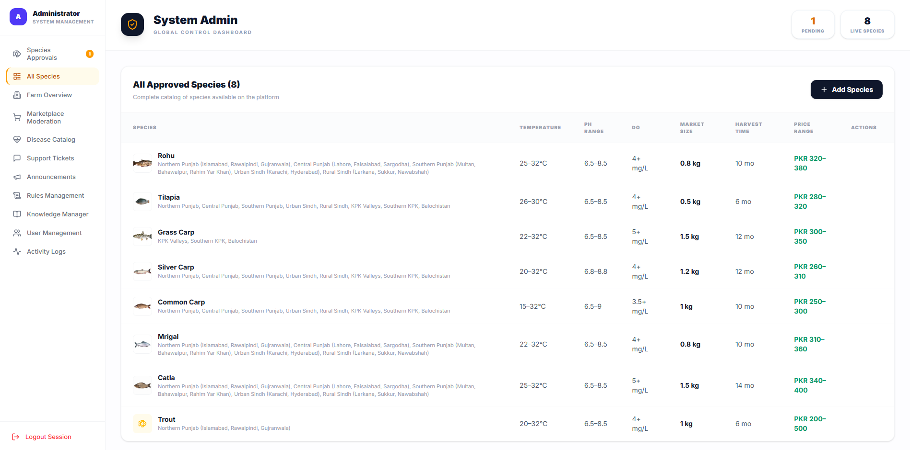
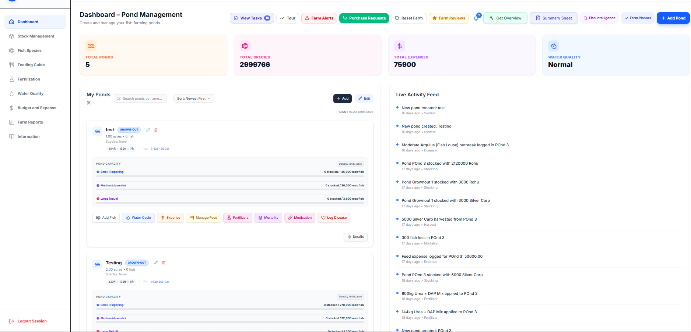
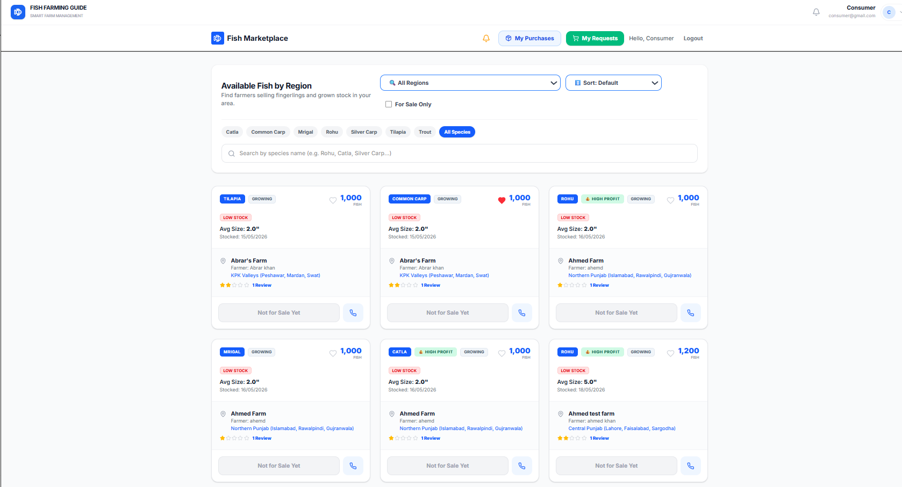
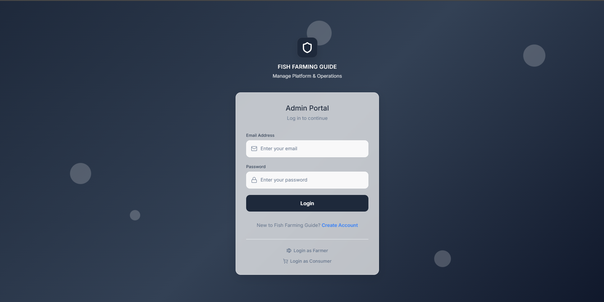
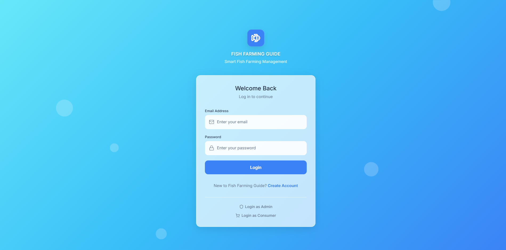
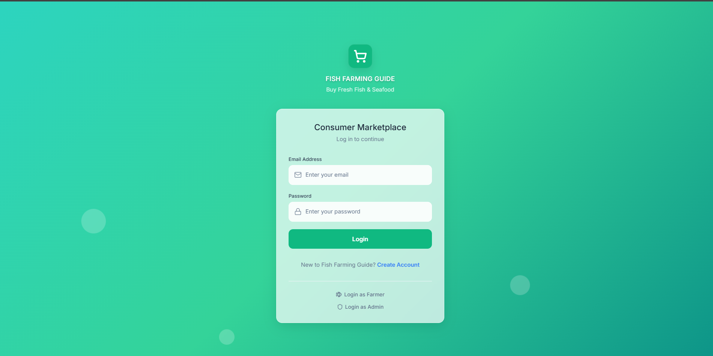

# 🐟 Aquaculture Management Platform
### Fish Farming Guide

A comprehensive web-based aquaculture management platform developed as a Computer Science Final Year Project (FYP), designed to support fish farmers with farm planning, stock management, feeding, water-quality monitoring, marketplace operations, and data-driven aquaculture workflows.

## 🎓 Project Overview
Aquaculture Management Platform (Fish Farming Guide) is a Computer Science Final Year Project. It is a web-based platform supporting fish farming/aquaculture management, helping to bridge the gap between traditional farming and modern data-driven practices.

## ✨ Key Features
- Pond & Capacity Planning
- Polyculture Feeding Zone Alignment
- Water Quality Monitoring
- Stock & Feeding Management
- Harvest and ROI Tracking
- P2P Digital Marketplace
- FIFO Inventory Handling
- Regional/Geospatial Functionality
- Role-Based Access Control
- Admin / Farmer / Consumer Workflows
- JWT Authentication
- bcrypt Password Hashing
- Species Management
- Feed Rules

## 🏗️ Architecture
### Frontend
- React
- Vite
- TailwindCSS
- React Router
- Leaflet / React Leaflet

### Backend
- Node.js
- Express
- REST API

### Database
- Microsoft SQL Server

### Authentication
- JWT
- bcrypt
- role-based access control

## 🛠️ Technology Stack
- React
- Vite
- TailwindCSS
- Node.js
- Express
- Microsoft SQL Server
- JWT
- bcrypt
- Leaflet
- Postman
- Git

## 📂 Project Structure
```text
FishFarmingGuide/
├── backend/
│   ├── config/
│   ├── middleware/
│   ├── routes/
│   ├── server.js
│   ├── package.json
│   ├── package-lock.json
│   ├── .env.example
│   └── FishFarm.postman_collection.json
├── database/
│   └── schema.sql
├── docs/
│   └── evaluation/
├── fish-farming-guide/
├── screenshots/
│   ├── admin-login.png
│   ├── admin-dashboard.png
│   ├── farmer-login.png
│   ├── farmer-dashboard.png
│   ├── consumer-login.png
│   └── consumer-dashboard.png
├── PROJECT_TECHNICAL_REFERENCE.md
├── .gitignore
└── README.md
```

## 🖥️ Application Screenshots

### Admin Dashboard


### Farmer Dashboard


### Consumer Dashboard


### 🔐 Role-Based Access
The application provides dedicated authentication and workflows for Admin, Farmer, and Consumer roles.





## 🚀 Installation & Setup

### Prerequisites
- Node.js
- npm
- Microsoft SQL Server
- SQL Server Management Studio or equivalent SQL client

### Database Setup
1. Create the required SQL Server database.
2. Run `database/schema.sql`.
3. Note: Real development/user data was intentionally excluded from the public repository. The provided schema contains the public database schema and safe generic seed/configuration data.

### Backend Setup
Navigate to the backend directory and install dependencies:
```bash
cd backend
npm install
```
Create a local environment file from the example:
```bash
cp .env.example .env
```
Configure your own database credentials and JWT secret inside the `.env` file.

Start the backend:
```bash
node server.js
```
The default backend port is `5000` unless `PORT` is configured otherwise.

### Frontend Setup
Navigate to the frontend directory, install dependencies, and start the development server:
```bash
cd fish-farming-guide
npm install
npm run dev
```
For a production build, run:
```bash
npm run build
```

## 🔐 Environment Configuration
The application requires the following environment variables. The `backend/.env` file is intentionally excluded from GitHub. Each developer must create their own local `.env` file based on `.env.example`. No real credentials are included in the public repository.

Required variables:
- `DB_SERVER=`
- `DB_NAME=`
- `DB_PORT=`
- `DB_USER=`
- `DB_PASSWORD=`
- `JWT_SECRET=`
- `PORT=`

## 🗄️ Database
The `database/schema.sql` script contains the public database schema and safe generic seed/configuration data. Real development and user records were strictly removed before publication.

## 📚 API & Documentation
- **Postman API Collection:** `backend/FishFarm.postman_collection.json` can be imported into Postman for API testing. Authentication tokens are handled using Postman variables rather than publishing real tokens.
- **Technical Reference:** Detailed mathematical algorithms and schema architectures are documented in `PROJECT_TECHNICAL_REFERENCE.md`.
- **Evaluation Details:** Feature-toggle documentation and grading configurations are stored in `docs/evaluation/`.

## 🔮 Future Improvements
- IoT-based water-quality sensor integration
- expanded marketplace functionality
- advanced predictive analytics
- additional automation for aquaculture monitoring

## 👥 Project Team

This project was developed collaboratively as a Computer Science Final Year Project.

- **Daniyal Janjua**
- **Haider Ali** — [GitHub](https://github.com/Ali-Haider7)
- **Zainab Muskan** — [GitHub](https://github.com/zainab-muskan)

## 📜 License
License information will be finalized before the public release. The project license will be decided with all project contributors before publication.
